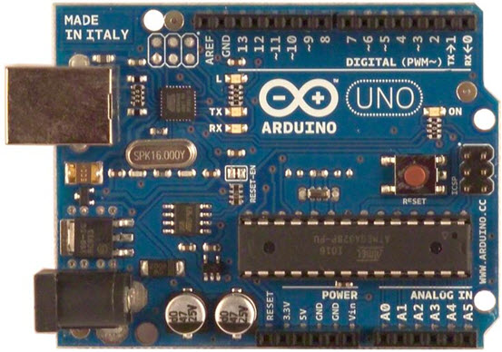
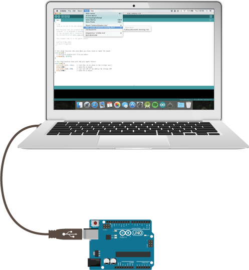
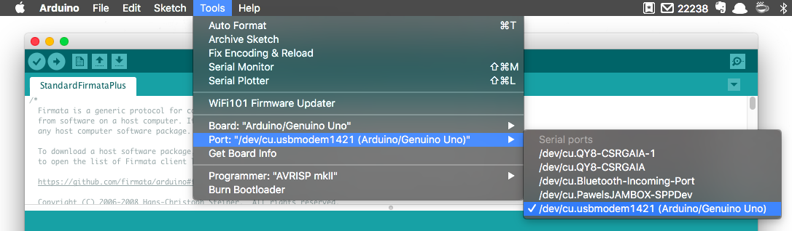
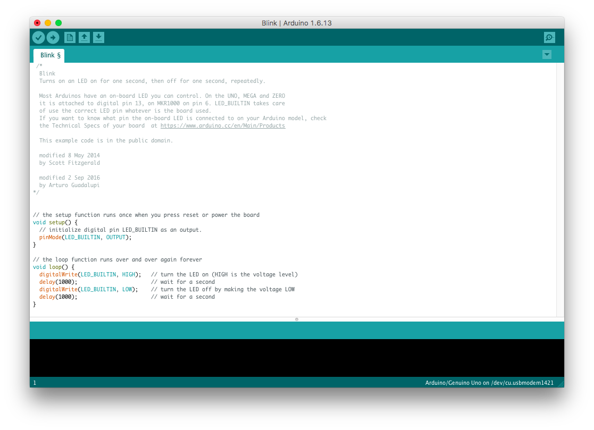
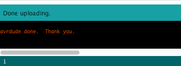
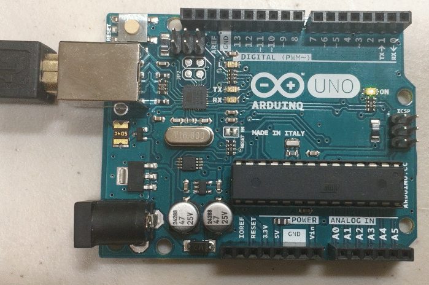

# Arduino Quick Start Guide

What is an Arduino? This is an Arduino:



An Arduino is a very simple computer. It doesn't have a monitor or keyboard, and it can only store and run one app (or program) at a time. You can write a program for it using your normal big computer by connecting it with a USB cable. Once you've saved your program to the Arduino, you can disconnect the cable and just run it on batteries.

The Arduino has a lot of input and output pins you can connect wires to, and it's good at controlling simple things like motors, lights, speakers and sensors. That's why it's perfect for making interactive holiday decorations for an event like Tech the Halls!

In order to write a program for the Arduino, you'll first need to download a special piece of software called the Arduino IDE. IDE means `Integrated Development Environment` and it's just a program that lets you write programs and send them to the Arduino.

## Install the Arduino IDE

The following link has a version of the Arduino IDE Software for Windows, Mac and Linux:

[Arduino IDE Download Page](https://www.arduino.cc/en/Main/Software)

Please download and install the Arduino IDE software that's appropriate for the computer you're using. If you're not sure how to install software, ask one of our volunteers to help you out!

Once you've finished installing, be sure to start the Arduino IDE so that you're ready for the next step.

## Connect the Arduino to your PC

Using the provided USB cable connect the Arduino just like this:



## Tell the IDE where the Arduino is

Now that you're connected the Arduino, you'll need to tell the Arduino IDE which port it is connected to. Go to `Tools -> Port` and look for an option that says `(Arduino/Genuino Uno)` next to it. If you're on a Mac or Linux, this might look like `/dev/cu.usbmodem1412`, while on a Windows PC it might look like `COM4`. While you are in there make sure that the Board setting under `Tools -> Board` is set to `Arduino/Geuino Uno`.



## Upload a sample program and run it

Now let's load an example program into the Arduino. Go to the menu again and select `File -> Examples -> 01. Basics -> Blink`. This will load up the example blink progam into the editor and your screen should look like this:



Look over the code a little bit if you want, but we'll talk about it shortly. First, let's make the Arduino do something. Hit the Upload button, which looks like an arrow pointing to the right. This one:


Give it a few seconds to process. If everything went well, you should see something like this toward the bottom of your window:



Note: If you don't see that, something may have gone wrong. Ask one of our volunteers and we'll try to figure it out together!

Look at your Arduino. Hopefully, there is a small blinking light (or LED) next to the L:



## The Program

Let's take a look at the program that's running on it:

```c
// the setup function runs once when you press reset or power the board
void setup() {
  // initialize digital pin LED_BUILTIN as an output.
  pinMode(LED_BUILTIN, OUTPUT);
}

// the loop function runs over and over again forever
void loop() {
  digitalWrite(LED_BUILTIN, HIGH);   // turn the LED on (HIGH is the voltage level)
  delay(1000);                       // wait for a second
  digitalWrite(LED_BUILTIN, LOW);    // turn the LED off by making the voltage LOW
  delay(1000);                       // wait for a second
}
```

The lines that start with `//` are comments or notes that we leave ourselves to explain things that the arduino ignores.

Arduino programs are divided into two sections. One called `setup` that runs once when the Arduino powers on, and another one called `loop` that runs forever. In our example program, everything between `void setup() {` and `}` is part of the setup section, and everything between `void loop() {` and `}` is part of the loop section.

## Other lines:

#### pinMode(LED_BUILTIN, OUTPUT);

The Arduino has a bunch of pins or places you can connect wires called GPIO, which stand for `General Purpose Input and Output`. Because they are General Purpose, you'll need to tell the Arduino if you want to use it for INPUT or OUTPUT. That's what this line is doing to the pin called `LED_BUILTIN`, which is hooked up the special internal led. Other pins are called things like `A0` or `9` - see if you can find where they are on the Arduino!

#### digitalWrite(LED_BUILTIN, HIGH);

When a pin is in output mode, you can turn it on or off by setting it to `HIGH` or `LOW`. This turns the LED on or off.

#### delay(1000);

This line literally does nothing but waste time. Things in the `loop` section run very quickly. If we didn't have a delay line here, the LED would turn on and off so quickly that we wouldn't be able to notice it. In this particular line we are delaying for `1000` milliseconds, or 1 second. If you wanted to delay for half a second, you could change it to `500`.

## Hack It Up

- Try to change the program so that the LED blinks faster.

- There is a communication system ships at sea sometimes use to communicate via light or sound, where each letter is encoded as a series of dashes (long blinks) and dots (short blinks). SOS is encoded as `... --- ...`. Can you make the LED blink SOS?