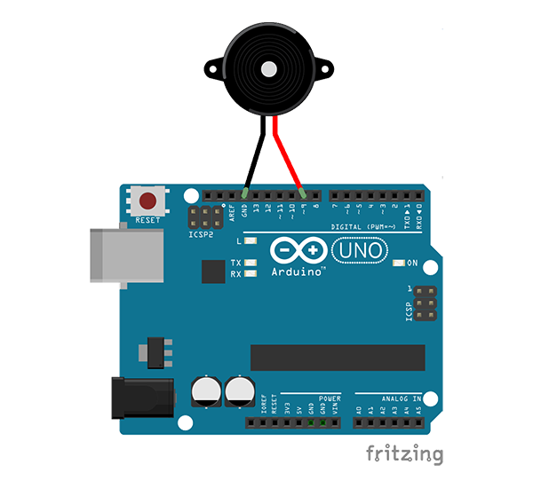
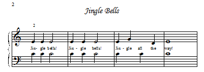

# Making Beepy Music

Playing music on an Arduino is super easy. All you need is the Arduino and a little speaker to plug into it. You can connect them like this:



Note that the colors of the wires matter. The black wire should go into the pin labeled `GND` and the red wire should go into the pin labeled `~9`.

## Writing Some Tones

Let's create a new project in the Arduino IDE, by selecting `File -> New`. You'll should see an empty program template like this:

```c
void setup() {
  // put your setup code here, to run once:

}

void loop() {
  // put your main code here, to run repeatedly:

}
```

The Arduino library comes with a useful function to generate a tone, oddly enough, called `tone`.

In the loop section of the program template, add `tone(9, 262);` so that the loop section looks like:

```c
void loop() {
  // put your main code here, to run repeatedly:
  tone(9,262);
}
```

..and then hit `Upload`. After the IDE has finished compiling and uploading your program, the Arduino should start making noise. If you have an ear for notes, it should sound pretty close to middle C.

It's OK to unplug the USB cable now if the sound is getting annoying.

What does this line do? The first number between the parenthesis is the pin number of the speaker. We plugged it into pin 9, remember? The second number is the frequency in hertz of the tone we want to generate. In our case, middle C is 261.6Hz, but we just rounded it to 262.

You can see a table of notes and their associated frequencies at [http://www.phy.mtu.edu/~suits/notefreqs.html](http://www.phy.mtu.edu/~suits/notefreqs.html)

## Adding More Notes

If we want to play a melody using more than one note, we'll have to put in a delay after each one. This this:

```c
tone(9, 550);
delay(500);
tone(9, 440);
delay(500);
```

You should hear something that sounds like a British police siren!

There is a problem if we try to play a song with this code though - the notes would all blend together. The key is to play the note for a shorter time than we delay for. You can add a third number to the `tone` function to tell it now long you want the note to play:

```c
tone(9, 330, 400);
delay(500);
tone(9, 294, 400);
delay(500);
tone(9, 262, 400);
delay(1000);  
```

## Simplifying Things

That all seems to work great, but it's a lot to type! There are definitely some things we can do to make it easier to enter songs. Most programming languages have ways of grouping frequently used lines of code together, called functions. We can add a simple `playNote` function to make things easier. Add these lines somewhere after `void loop() {...}`:

```c
void playNote(int value, int duration) {
  int ms = 1000 / duration;
  tone(9, value, ms);
  delay(ms * 1.5);
}
```

Now instead of using `tone()` directly, you can write something like the following:

`playNote(330, 4);`

..to play an 'E' note for 250ms, or 1/4 of a second, or if you like, the duration of a quarter note at 240 beats per minute.

We can still do better though, and not have to remember the frequencies. Somewhere at the top of your file, add the following lines:

```c
#define E 330
#define G 392
#define C 262
#define D 294
```

Now you should be able to write a program that looks like this:

```c
#define E 330
#define G 392
#define C 262
#define D 294

void setup() {
}

void loop() {
  playNote(E, 4);
  playNote(E, 4);
  playNote(E, 2);
  playNote(E, 4);
  playNote(E, 4);
  playNote(E, 2);
  playNote(E, 4);
  playNote(G, 4);
  playNote(C, 4);
  playNote(D, 4);
  playNote(E, 1);
  delay(1000);
}

void playNote(int value, int duration) {
  int ms = 1000 / duration;
  tone(9, value, ms);
  delay(ms * 1.5);
}
```

Does it sound familiar? I hope so! It was transcribed from this sheet music:



See if you can find some other melodies you'd like to transcribe!

## Bonus : Making it louder!

The little speakers we use aren't very loud, but you can boost the audio by giving your speaker a little paper hat!

Download and print the template below, then glue it together to make a cone:

[Download Printable Template](amplifier.pdf)

[](https://www.youtube.com/watch?v=3qatnelww9w)

If you have different sized speaker, you can generate a custom cone template here:

[http://www.templatemaker.nl/index.php?template=cone&lang=en](http://www.templatemaker.nl/index.php?template=cone&lang=en)

## Useful Links

- [Play a Melody using the tone() function](https://www.arduino.cc/en/Tutorial/toneMelody) - the code in this tutorial was based on this.
- [tone() documentation](https://www.arduino.cc/en/Reference/Tone) - more detail on the use and limitations of this function