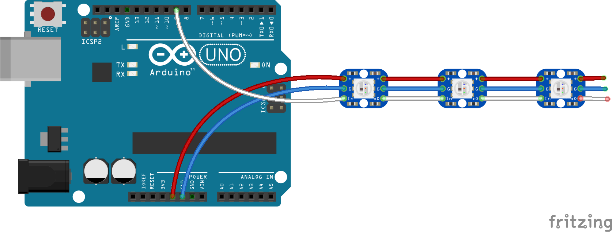

# Make It Blink

You can use the Arduino to control special types of light devices that use a type of LED called WS2811. You might also see WS2811 being called Neopixels by certain vendors like Adafruit.com. You can get WS2811 LEDs individually, or in a bunch of different shapes like grids, rings or strings. We happen to have a some string lights for you to play with!

The core features of WS2811 LEDs are that:

- they are RGB, meaning they can be any color you want by changing the mix of Red, Green and Blue in each light

- they are "individually addressable", meaning that each light in the string doesn't have to be the same color. You can light the first light to be red, and the second light to be purple if you want.

## Connecting to the Arduino

You can connect a WS2811 string to the Arduino like this:



Note that in the diagram, the order of the wire colors is Red, Blue, White. On the strips we have, the order is Red, White, Blue. Just go by the wire colors and everything should be fine.

|LED wire|Arduino Pin|Function|
|--------|----------:|-------:|
|Red|5V|Power|
|White|6|Signal|
|Blue|GND|Ground|

## Get the required library

Unlike the motor tutorial, you'll need to take an extra step in order to write a program for the light strip.

- In the Arduino IDE menu, select `Sketch -> Include Library -> Manage Libraries`.

- A list of libraries should pop up and there will be a box that says 'Filter your search'.

- Type in "neopixel"

- Finally click on the library called `Adafruit Neopixel` and click 'Install'


Once it's done installing, you are ready to make pretty lights!


## Starter Code

The code to start off any project using an LED strip will look pretty much the same:

```c
#include <Adafruit_NeoPixel.h>

Adafruit_NeoPixel strip = Adafruit_NeoPixel(50, 6, NEO_RGB + NEO_KHZ800);

void setup() {
  strip.begin();
  strip.show();
}

void loop() {
  strip.setPixelColor(0, 255, 0, 0);
  strip.show();
}
```

If you've hooked everything up correctly, this code will set the color of the first light to red.

There are probably a few things you haven't seen before:

#### `#include <Adafruit_NeoPixel.h>`

The details of controlling a light strip are actually kind of complicated. Luckily, you don't have to worry about all of the details. Someone else already wrote most of that code for you and put it into a library so that you can use it in your program. This line is stating that we're going to use that library in our code.

#### `Adafruit_NeoPixel strip = Adafruit_NeoPixel(50, 6, NEO_RGB + NEO_KHZ800);`

This line is declaring that we're going to be using a lightstrip in our program and we're going to call it `strip`. It also tells the Arduino how big the light strip is and where it's connected:

- Adafruit_NeoPixel(`50`, 6, NEO_RGB + NEO_KHZ800); - the first number, `50` says there are 50 lights in the strip.

- Adafruit_NeoPixel(50, `6`, NEO_RGB + NEO_KHZ800); - the second number, `6` says we've connected the white signal wire to pin 6.

- Adafruit_NeoPixel(50, 6, `NEO_RGB + NEO_KHZ800`); - the rest of this won't change for the strips that we're using.

#### `strip.begin();`

We need this line in the `setup()` section for the strip to work.

#### `strip.show();`

We need this line in `setup()`, but also any time we want to update the light strip with our new color choices.

#### `strip.setPixelColor(0, 255, 0, 0);`

This line sets the first light in the string to red:

- strip.setPixelColor(`0`, 255, 0, 0); - this is the light number. The first one is always `0`, followed by `1`, `2` etc.

- strip.setPixelColor(0, `255`, 0, 0); - this is the amount of red to show. `255` is the maxium possible value for any color.

- strip.setPixelColor(0, 255, `0`, 0); - this is the amount of green to show. `0` means 'no green'.

- strip.setPixelColor(0, 255, 0, `0`); - this is the amount of green to show. `0` means 'no green'.

## Red, Green, Blue (RGB)


In the code above, we saw you can specify how red, green, or blue to make a light. What about the other colors? The answer is mixing. The way computer and TV screens show different kinds of colors is by mixing different levels of red, green and blue.

For example, to set a pixel to yellow, you can write:

`strip.setPixelColor(0, 255, 255, 0); // yellow`

Looking at the image above, you might be able to guess that you can get pink by mixing red and blue:

`strip.setPixelColor(0, 255, 0, 255); // pink`

And pure white by setting all three to the maximum value:

`strip.setPixelColor(0, 255, 255, 255); // white`

If you have a background in painting, you might notice that the colors mix a little bit differently than they do on the palette because here were are dealing with light and not pigments.

You can also get all the colors in between by mixing various levels. Say, adding more red than green to get an orangish color:

`strip.setPixelColor(0, 255, 50, 0 ); // orange`

You can experiment with different levels, or you can use a color picking tool like this one:

[http://www.colorpicker.com/](http://www.colorpicker.com/)

Just make sure you use the R, G and B values and not the H, S and B.

## Turning on other lights

So far we've only been turning on the first light, but the first number in `setPixelColor` is the number of the light to turn on. Let's try to make a rainbow:

```c
#include <Adafruit_NeoPixel.h>

Adafruit_NeoPixel strip = Adafruit_NeoPixel(50, 6, NEO_RGB + NEO_KHZ800);

void setup() {
  strip.begin();
  strip.show();
}

void loop() {
  strip.setPixelColor(0, 255, 0, 0 ); // red
  strip.setPixelColor(1, 255, 50, 0 ); // orange
  strip.setPixelColor(2, 255, 200, 0 ); // yellow
  strip.setPixelColor(3, 0, 255, 0 ); // green
  strip.setPixelColor(4, 0, 0, 255 ); // blue
  strip.setPixelColor(5, 0, 255, 255 ); // indigo
  strip.setPixelColor(6, 255, 0, 200 ); // violet
  strip.show();
}
```

If all went well, you should see something like this:


## Controlling lots of lights

It seems like a lot of work to set each light individually though. If you have 50 lights, you might need to write 50 lines of code!

Fortunately, there is an easier way. You can use something called a `for` loop. There is a more detailed description in the section on [motors](../move/README.md), but briefly it looks like this:

```c
for (int i=0;i<=50;i++) {
  strip.setPixelColor(i, 255, 0, 0);
}
strip.show();
```

This will turn all lights starting from 0 to 50 to red. If we wanted to flash between red and green, we can do something like this:

```c
for (int i=0;i<=50;i++) {
  strip.setPixelColor(i, 255, 0, 0);
}
strip.show();
delay(1000);
for (int i=0;i<=50;i++) {
  strip.setPixelColor(i, 0, 255, 0);
}
strip.show();
delay(1000);
```

## One size doesn't fit all

You don't need to run an entire string of 50 lights. If you are making a smaller decoration, we can cut a strip down to size for you! You'll just need to go back and make sure you write the correct number into the line that starts with `Adafruit_NeoPixel`. For example, when working with 9 lights, the line should look like this:

`Adafruit_NeoPixel strip = Adafruit_NeoPixel(9, 6, NEO_RGB + NEO_KHZ800);`

## I'm so random

You can create some very colorful light shows by using the Arduino's random() function to pick color values for you between 0 and 255. Try this program:

```c
#include <Adafruit_NeoPixel.h>

Adafruit_NeoPixel strip = Adafruit_NeoPixel(50, 6, NEO_RGB + NEO_KHZ800);

void setup() {
  strip.begin();
  strip.show();
}

void loop() {
  for (int i=0;i<=50;i++) {
    strip.setPixelColor(i, random(0,255), random(0,255), random(0,255));
  }
  strip.show();
  delay(1000);
}
```


## Advanced Stuff

Finally, you might be able to pick up advanced techniques by looking at the example code provided with the Neopixel library. In the Arduino IDE menu, select `File -> Examples -> Adafruit NeoPixel -> strandtest`. There are some fun effects in there.

