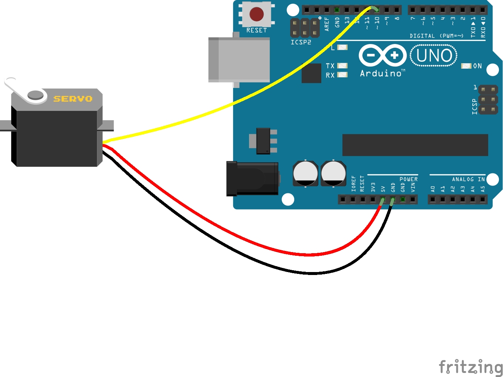
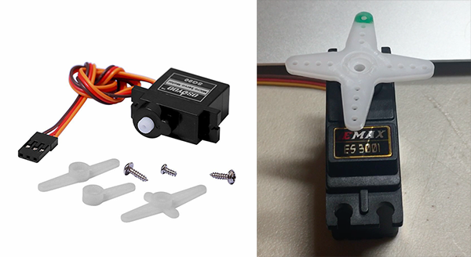
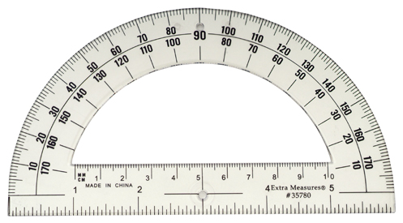
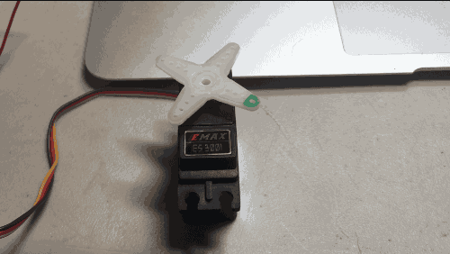

# I Like To Move It Move It

A servo is a special kind of motor that can move between several specific positions accurately. It's often used for things like controlling the rudders on small radio controlled planes.

You can hook one up to an Arduino like this:



In the diagram, the servo motor has black, red and yellow wires. Your servo might have an orange wire instead of a yellow one. That's OK.

|Servo Wire|Arduino Pin|Purpose|
|----------|----------:|------:|
|Red|5V|Power|
|Black or Brown|GND|Ground|
|Yellow or Orange|10|Signal|

## Servo horns

The little white or black plastic parts in your bag are called servo horns. You can pop them on to the top of your servo to make it easier to attach things to it. You can put one on now and mark one side of it with a sharpie so it's easier to see how it's moving.




## Starter code

The code to start off any project using a servo will look pretty much the same:

```c
#include <Servo.h>

Servo myservo;

void setup() {
  myservo.attach(10);
}

void loop() {
  myservo.write(90);
}
```

There are probably a few things you haven't seen before:

#### `#include <Servo.h>`

The details of controlling a servo motor are actually kind of complicated. Luckily, you don't have to worry about all of the details. Someone else already wrote most of that code for you and put it into a library so that you can use it in your program. This line is stating that we're going to use that library in our code.

#### `Servo myservo;`

This line is declaring that we're going to be using one servo in our program and we're going to call it `myservo`. If we were going to use two servos, we'd just add another line like this and call it something different, like `Servo anotherservo;`

#### `myservo.attach(10);`

In the `setup()` section, this line says that we have attached the signal wire of the servo to pin 10.

#### `myservo.write(90);`

This line moves the servo to the 90 degree position. As you'll see in the next section, this is the center position of the servo. You can put different numbers here between 0 and 180 and see what happens when you upload and run the code.

## Servo positions



Most servos can move to any position between 0 and 180 degrees. To move it to that position, you just call `myservo.write();` with the desired position between the parenthesis.

Here is a sample program that will move to 0 degrees, 90 degrees and then 180 degrees with a 1 second delay between each movement.

```c
#include <Servo.h>

Servo myservo;

void setup() {
  myservo.attach(10);
}

void loop() {
  myservo.write(0);
  delay(1000);
  myservo.write(90);
  delay(1000);
  myservo.write(180);
  delay(1000);  
}
```



## Setting the speed

There isn't really a way of telling most servos how fast they should move. As you may have noticed, you just tell the servo the position you want it to be in, and it will go to that position as fast as it can.

There is a workaround though - you just need to move a little bit at a time while adding delay statements in between each position. To move from 90 to 95 degrees a little bit slower than usual, you can write something like this:

```c
myservo.write(90);
delay(100);
myservo.write(91);
delay(100);
myservo.write(92);
delay(100);
myservo.write(93);
delay(100);
myservo.write(94);
delay(100);
myservo.write(95);
delay(100);
```

The larger the delay is, the slower the servo will move.

As you can see, it takes up quite a bit of space and is pretty repetitive. This would be a lot worse if you wanted to move more than just 5 degrees!

## Introducting the `for` loop!

You can rewrite the last bit of code like this:

```c
for (int i=90;i<96;i++) {
  myservo.write(i);
  delay(100);
}
```

It might look a little bit confusing if you haven't seen it before, but let's break down how it works.

A `for` loop is basically a counter that starts at a specific number, and ends at another number. The stuff in between the parentheses `()` tells us:

- `int i=90` - where to start: at 90
- `i<96` - when to stop: keep going while we are less than 96
- `i++` - how to get there: i++ means we add 1 each time

The stuff in between the curly braces `{}` is what we want to repeat.

```c
myservo.write(i);
delay(100);
```

Instead of writing `90` to the servo, we used the letter `i` which will change for each step of the loop. The first time it runs it will be 90, then 91 and so until we reach 95.

There's no reason to only move 5 degrees though. Try this program which will move from 90 to 180 degrees slowly:

```c
#include <Servo.h>

Servo myservo;

void setup() {
  myservo.attach(10);
}

void loop() {
  for (int i=90;i<180;i++) {
    myservo.write(i);
    delay(100);
  }
}
```

## Hack it up!

Try changing the delay to move the servo motor at a speed that you like.

In the example program, we move from 90 to 180 degrees slowly, but then the servo moves back to 90 very quickly. See if you can add another `for` loop to move it back slowly.

### Pro Tip!

`for` loops don't have to move forward. You can go from 180 down to 90 like this:

`for (i=180;i>90;i--) {`

Note that:

- Our starting number is now `180`
- Our ending number is `90` AND we are using  greater-than `>` instead of less-than
- We are using `i--` to subtract one instead of `i++`

You can accidentally write a `for` loop that will never end if accidentally use `i++` instead of `i--` or `<` instead of `>`.