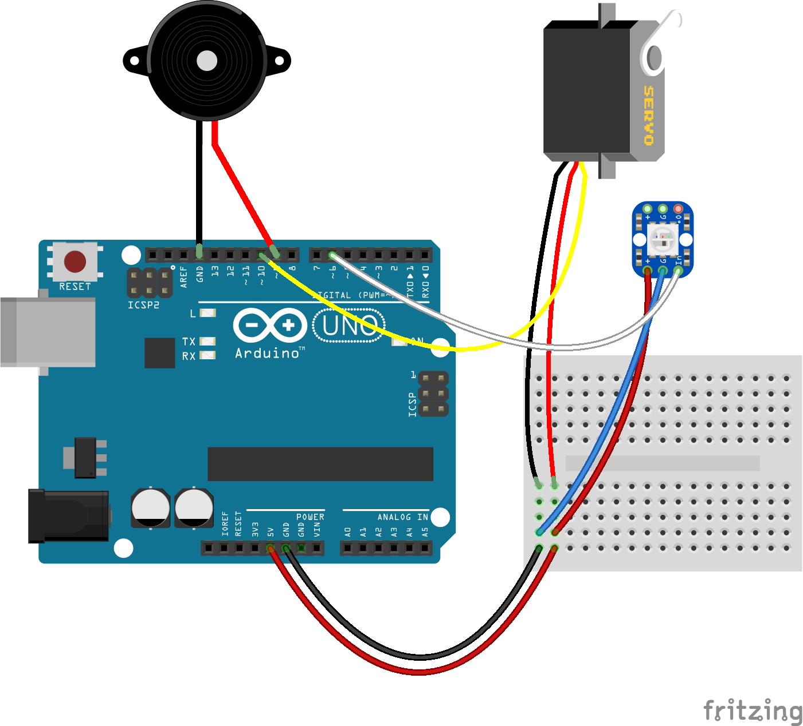

# Advanced Stuff : Reinduino

Reinduino is a somewhat advanced demonstration project that combines, music, motion and sound.


## Wiring Diagram



Note the use of the breadboard to connect more than one wire to the same 5V and GND pins.

## Code

This is the code that make Reinduino run:

```c
#include <Adafruit_NeoPixel.h>
#include <Servo.h>

#define NEOPIXEL_PIN 6
#define SPEAKER_PIN 9
#define SERVO_PIN 10
#define NOTE_COUNT 110
#define LOOP_DELAY 50

#define A 440
#define B 494
#define E 330
#define G 392
#define C 523
#define D 294
#define F 349

int notes[] = {
  G,A,G,E,C,A,G,G,A,G,A,G,C,B,
  F,G,F,D,B,A,G,G,A,G,A,G,A,E,
  G,A,G,E,C,A,G,G,A,G,A,G,C,B,
  F,G,F,D,B,A,G,G,A,G,A,G,A,E,
  A,A,C,A,G,E,G,F,A,G,F,E,
  D,E,G,A,B,B,B,C,C,B,A,G,F,D,
  G,A,G,E,C,A,G,G,A,G,A,G,C,B,
  F,G,F,D,B,A,G,G,A,G,A,G,D,C

};

int durations[] = {
  8,4,8,4,4,4,2,8,8,8,8,4,4,1,
  8,4,8,4,4,4,2,8,8,8,8,4,4,1,
  8,4,8,4,4,4,2,8,8,8,8,4,4,1,
  8,4,8,4,4,4,2,8,8,8,8,4,4,1,
  4,4,4,4,4,4,2,4,4,4,4,1,
  4,4,4,4,4,4,2,4,4,4,4,4,4,2,
  8,4,8,4,4,4,2,8,8,8,8,4,4,1,
  8,4,8,4,4,4,2,8,8,8,8,4,4,1
};

Adafruit_NeoPixel nose = Adafruit_NeoPixel(1, NEOPIXEL_PIN, NEO_GRB + NEO_KHZ800);
Servo head;
unsigned long loopCount = 0;
unsigned long nextNoteIn = 0;
int nextNoteNum = 0;

void setup() {
  nose.begin();
  nose.show();
  head.attach(SERVO_PIN);
  head.write( 90 );
}

void loop() {
  float s = sin((float) loopCount / 7);
  float c = cos((float) loopCount / 3);

  int redLevel = 155 + (c * 100);
  nose.setPixelColor(0, 0, redLevel, 0 );
  nose.show();

  int headPos = 90 + (s * 18);
  head.write(headPos);

  playNote();

  delay( LOOP_DELAY );
  loopCount++;
}

void playNote() {
  unsigned long timer = loopCount * LOOP_DELAY;
  if (timer >= nextNoteIn) {
    int note = notes[ nextNoteNum ];
    int duration = durations[ nextNoteNum ];
    int ms = 1000 / duration;
    tone(SPEAKER_PIN, note, ms);
    nextNoteIn = timer + (ms * 1.2);
    nextNoteNum++;
    if (nextNoteNum >= NOTE_COUNT) {
      nextNoteNum = 0;
    }
  }
}
```